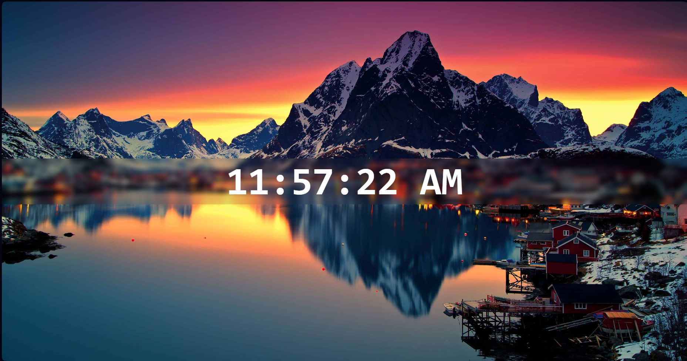

# 🕒 Digital Clock

A clean, modern, and responsive **Digital Clock** built using **HTML**, **CSS**, and **JavaScript**. This project displays the current system time in **12-hour format (AM/PM)** and updates automatically every second.

Designed with a fullscreen background image and a beautiful glassmorphism effect, this project demonstrates real-time DOM manipulation, JavaScript timing functions, and responsive web design.

---

## 📸 Preview



---

## ✨ Features

- ⏰ Live digital clock
- 🕛 12-hour format with AM/PM
- 🔄 Updates automatically every second
- 🎨 Glassmorphism UI
- 🖼️ Fullscreen responsive background image
- 📱 Responsive design
- ⚡ Lightweight and fast
- 🌐 Compatible with modern browsers

---

## 🛠️ Built With

- HTML5
- CSS3
- JavaScript (ES6)

---

## 📂 Project Structure

```text
DIGITAL-CLOCK/
│
├── index.html
├── style.css
├── index.js
├── preview.png
├── README.md
└── images/
    └── background-image.jpg
```

---

## 🚀 Getting Started

### Clone the repository

```bash
git clone https://github.com/vaibhavsunilsarda37/Digital-Clock.git
```

### Run the project

Open `index.html` in your web browser.

No installation or dependencies are required.

---

## ⚙️ How It Works

- Retrieves the current system time using JavaScript's `Date` object.
- Converts the time into a 12-hour format with AM/PM.
- Uses `padStart()` to maintain two-digit formatting.
- Updates the displayed time every second using `setInterval()`.
- Dynamically updates the webpage through DOM manipulation.

---

## 📚 Concepts Practiced

- HTML5
- CSS3
- Flexbox
- Responsive Design
- Glassmorphism
- JavaScript Functions
- Date Object
- DOM Manipulation
- Template Literals
- String Formatting (`padStart()`)
- Timers (`setInterval()`)

---

## 🎯 Future Improvements

- 📅 Display current date
- 🌍 Multiple time zones
- 🌙 Dark / Light mode
- ⏱️ Stopwatch
- ⏲️ Countdown timer
- ⏰ Alarm functionality
- 🎞️ Smooth animations

---

## 👨‍💻 Author

**Vaibhav Sunil Sarda**

- GitHub: https://github.com/vaibhavsunilsarda37
- LinkedIn: https://www.linkedin.com/in/vaibhav-sarda-baa532308
- X: https://x.com/vaibhavships

---

## 📄 License

This project is licensed under the MIT License.

---

## ⭐ Support

If you enjoyed this project, consider giving it a ⭐ on GitHub!